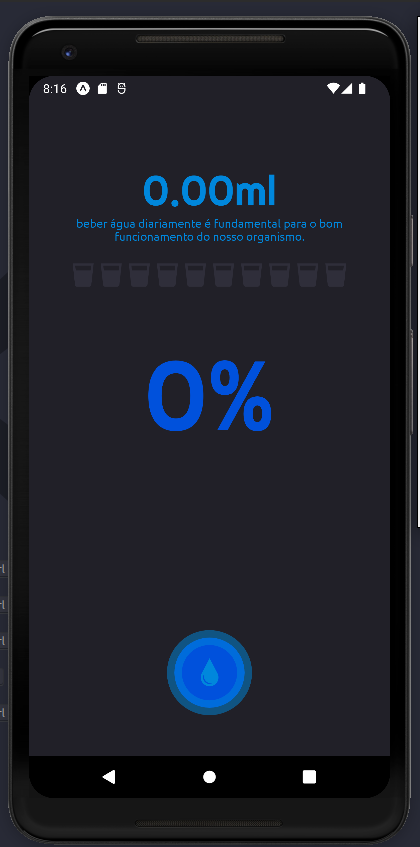
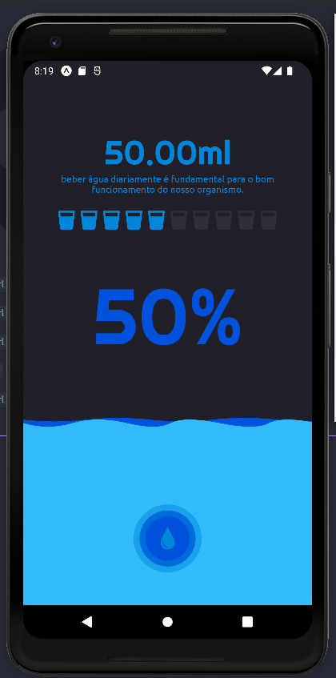
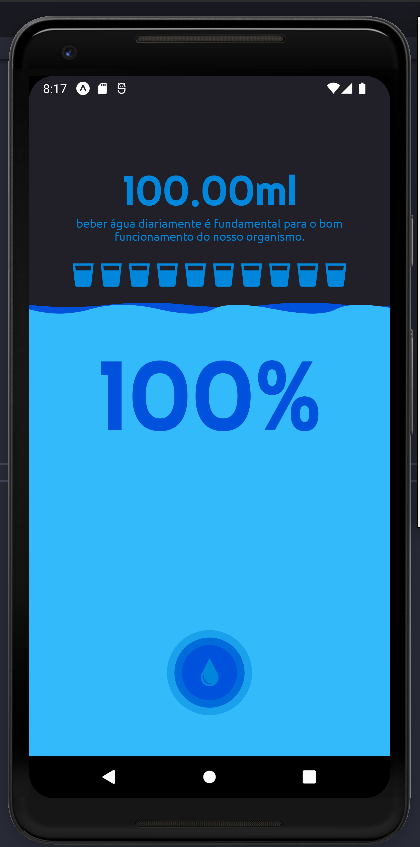

<table>
<tr>
 <td valign="top"></td>
 <td valign="top"></td>
 <td valign="top"></td>
 <tr/>
</table>

## 💻 Projeto

SVG (Scalable Vector Graphics) is an amazing technology that is not only very lightweight but also scalable. This makes it possible to adapt an image (vector), which will be able to be resized without worrying about quality and distortion, something that can occur in bitmap images, for example. This project has the idea of exploring animations with SVG and helping people who have problems drinking water during the day.

## ✨ Tecnologias

- [x] Reanimated
- [x] Expo bare workflow
- [x] Typescript
- [x] Svg

## Executando o projeto

```bash
# Install the dependencies
$ yarn

# Start the project
$ expo start
```

---

<p align="center">Made with ❤️ by Davy de Souza</p>
